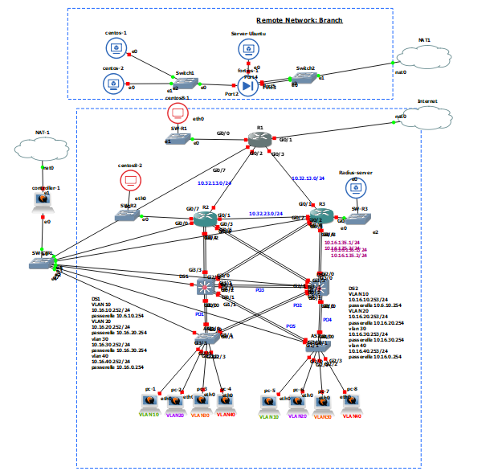

# Documentation générale du projet 4

Ce document présente globalement ce que nous avons mis en place grace au logiciel open source *GNS3*. Nous y décrirons les périphériques employés ainsi que les protocoles utilisés.

## 1 Topologie



## 2 Plan d'adressage
Le plan d'adressage de notre topologie est accessible ici *https://github.com/reseau-2020/projet-four/blob/master/topo/plan_adressage.md*.

### IPv4
En IPv4, nous avons utilisé des adresses en `10.32.X.X` pour les liaisons interne à la couche *CORE* et en `10.16.X.X` pour les liaisons entre les liaisons impliquant les couches *DISTRIBUTION* et *ACCESS*. Chaque sous-réseau possède un masque égal à 255.255.255.0. Le troisième octet des adresses renseigne sur la liaison entre les périphériques concernés. Par exemple, les routeurs *R1* et *R2* sont reliés en `10.32.12.1` (sur R1) et `10.32.12.2` (sur R2). On assigne 4 à *DS1* et 5 à *DS2*, ainsi *R3* et *DS2* sont reliés par `10.16.135.1` et `10.16.235.2` (sur *R3*), `10.16.135.2` et `10.16.235.1` (sur *DS2*).
Les *VLANs 10, 20, 30 et 40* prennent les adresses `10.16.10.X`, `10.16.20.X`, `10.16.30.X` et `10.16.40.X`.
Pour le site distant nous avons utilisé des adresses privées en `192.168.150.X`.

### Ipv6
Concernant l'adressage IPv6 (/64 par défaut), les adresses link-local sont :
- sur R1 : `fe80::1` (`fe80::cafe:4` sur g0/1 qui connecte l'internet)
- sur R1 : `fe80::2`
- sur R1 : `fe80::3`
- sur R1 : `fe80::d:1`
- sur R1 : `fe80::d:2`
- sur DS1 VLAN 10 : `fe80::d1:10`
- sur DS1 VLAN 20 : `fe80::d1:20`
- sur DS1 VLAN 30 : `fe80::d1:30`
- sur DS1 VLAN 40 : `fe80::d1:40`
- sur DS2 VLAN 10 : `fe80::d2:10`
- sur DS2 VLAN 20 : `fe80::d2:20`
- sur DS2 VLAN 30 : `fe80::d2:30`
- sur DS2 VLAN 40 : `fe80::d2:40`

les adresses privées sont :
- sur R1 (g0/0) : `2001:470:c814:4001::1:1`
- sur R2 (g0/0) : `2001:470:c814:4002::2:1`
- sur R3 (g0/0) : `2001:470:c814:4003::3:1`
- sur DS1 VLAN 10 : `2001:470:c814:4011::`
- sur DS1 VLAN 20 : `2001:470:c814:4021::`
- sur DS1 VLAN 30 : `2001:470:c814:4031::`
- sur DS1 VLAN 40 : `2001:470:c814:4041::`
- sur DS2 VLAN 10 : `2001:470:c814:4012::`
- sur DS2 VLAN 20 : `2001:470:c814:4022::`
- sur DS2 VLAN 30 : `2001:470:c814:4032::`
- sur DS2 VLAN 40 : `2001:470:c814:4042::`

et les adresses publiques sont :
- sur R1 (g0/0) : `fd00:fd00:fd00:1::1:1`
- sur R2 (g0/0) : `fd00:fd00:fd00:2::2:1`
- sur R3 (g0/0) : `fd00:fd00:fd00:3::3:1`
- sur DS1 VLAN 10 : `fd00:1ab:10::1`
- sur DS1 VLAN 20 : `fd00:1ab:20::1`
- sur DS1 VLAN 30 : `fd00:1ab:30::1`
- sur DS1 VLAN 40 : `fd00:1ab:40::1`
- sur DS2 VLAN 10 : `fd00:1ab:10::2`
- sur DS2 VLAN 20 : `fd00:1ab:20::2`
- sur DS2 VLAN 30 : `fd00:1ab:30::2`
- sur DS2 VLAN 40 : `fd00:1ab:40::2`

Nous n'avons pas attribué d'adresses IPv6 dans le site distant par manque de temps pour tester le tunnel VPN en IPv6. *DS1* et *DS2* jouent le rôle de serveur DHCPv6.

## 3 Les VLANs

Pour segmenter logiquement le réseau de la couche Access nous avons créer 4 VLANs pour 4 types d'utilisateurs différents :

* VLAN 10 : DATA
* VLAN 20 : VOICE
* VLAN 30 : CAMERA
* VLAN 40 : EXECUTIVE

La configuration des VLANs permet de résoudre plusieurs problèmes :

1. La sécurité : les VLANs permettent d'isoler les flux de données en fonction des utilisateurs (interfaces) mais aussi d'isoler certaines parties du réseau (server) sans recours à un routeur.
2. L'optimisation : avec une segmentation logique on peut créer plusieurs réseaux sans avoir besoin d'ajouter des switchs et des câbles
3. La qualité de service : On peut réserver de la bande passante pour certains usages (VoIP)

### 3.1 Configuration

On commence par créer et nommer les différentes VLANs sur les périphériques des couches Access et Distribution (DS1&2, AS1&2):

    vlan 10
    name DATA
    ...

Les interfaces physiques sur lesquelles le trafics de plusieurs vlans doit passer seront montées en mode trunk en ajoutant le protocole d'encapsulation dot1q (IEEE 802.1q).
Ce standard permet de modifier les trames Ethernet pour fournir un mécanisme d'encapsulation qui permet de faire passer le traffic de plusieurs VLANs sur un seul lien physique.
Le VLAN 99 sera le Vlan Natif, il sera utilisé pour le transport des trames ethernet non taggés sur les interfaces en mode trunk.

Le trunking est activé sur les interfaces de liaison entre la couche Access et Distribution (AS --> DS) mais aussi sur les interfaces de liaisons entre DS1 et DS2 qui assurent une redondance de liens.

    interface range g0/0,g1/0
     shutdown
     switchport trunk encapsulation dot1q     ! --> On active le protocole dot1q
     switchport trunk native vlan 99          ! --> On renseigne le VLAN natif
     switchport mode trunk                    ! --> On force le passage du mode DTP à "ON" pour activer le trunking
     no shutdown

## 3.2 Adressage des Vlans

On configure ensuite les interfaces virtuelles VLAN que l'on a créee sur différentes plages d'adresses IPv4 et IPv6.
Dans notre topologie on a choisit de faire varier le troisième octet du bloque d'adresses IPv4 pour différentier logiquement les périphériques des différents VLANs.

   |VLAN | Adresses ipv4  |  Adresses ipv6
   |-----|----|----|
   | VLAN10 | `10.16.10.0/24` | `fe80::d1:10` ; `fd00:1ab:10::1` ; `2001:470:c814:4011::`
   | VLAN20 | `10.16.20.0/24` | `fe80::d1:20` ; `fd00:1ab:20::1` ; `2001:470:c814:4021::` 
   | VLAN30 | `10.16.30.0/24` | `fe80::d1:30` ; `fd00:1ab:30::1` ; `2001:470:c814:4031::`
   | VLAN40 | `10.16.40.0/24` | `fe80::d1:40` ; `fd00:1ab:40::1` ; `2001:470:c814:4041::`
   
On configure les interfaces VLANs sur les périphériques DS1 et DS2. Sur le dernier octet on choisit d'attibuer 252 sur les interfaces de DS1 et 253 pour celles de DS2.

__Exemple vlan10 sur DS1:__

    interface vlan 10
     ip address 10.16.10.252 255.255.255.0
     ipv6 address fe80::d1:10 link-local
     ipv6 address fd00:1ab:10::1/64
     ipv6 address 2001:470:c814:4011::/64
     no shutdown
     ...
 
 Pour la mise en place du protocole de redondance de premier lien avec HSRP on utilisera les adresses virtuelles terminant en .254 (_ex: 10.16.10.254_) on utilisera aussi ces adresses comme passerelles lors de la configuration du DHCPv4.
 (Voir chapitres HSRP et DHCP).
 
 ### 3.3 Diagnostique

Pour diagnostiquer des erreurs sur les VLANs on peut utiliser les commandes suivantes:

- `show vlan`                   --> Voir les VLANs et les interfaces physiques associés
- `show interface trunk`        --> Voir les interfaces configurés en trunk
- `show dtp`                    --> Voir les paramètres du Dynamique Trunk Protocol
- `show interface switchport`   --> Voir la configuration de toutes les interfaces switchport 

## 4 Spanning-tree
Le protocol *Spanning-tree* est implémenté sur les 4 périphériques de couche 2 : *AS1*, *AS2*, *DS1* & *DS2*. *DS1* est `root primary` pour les vlans 10, 30 et 99 (natif) et `secondary` pour les vlans 20 et 40. Respectivement, *DS2* est `root primary` pour les vlans 20 et 40 et `secondary` pour les vlans 10, 30 et 99. Pour vérifier l'implémentation du SPT, on a éxécuté les commandes suivantes:
- show spanning-tree summary
- show spanning-tree
- show spanning-tree vlan X 

## 5 Etherchannel
Nous avons monté 5 ports Etherchannel :

Ports channel | Ports physique | Commutateurs
|-------------|----------------|-------------
po1  | g0/0, g1/0 | AS1-DS1
po2  | g0/1, g1/1 | AS1-DS2
po3  | g0/2, g1/2 | DS1-DS2
po4  | g0/0, g1/0 | AS2-DS2
po5  | g0/1, g1/1 | AS2-DS1

## 6 HSRP
Le HSRP permet d'obtenir une continuité de service LAN sur les routeurs et assurer une diponibilité de passerelle d'un réseau en cas de problème. 
Sur DS1 HSRP est active pour VLAN10 et VLAN30.
sur DS2 HSRP est active pour VLAN20 et VLAN40.
L'adresse IP virtuelle associée au groupe est la passerelle du vlan. 
HSRP est implémenté en IPv4 et IPv6 (les root secondary et primary dans notre cas sont inversés sur DS1 et DS2)
````
DS1#show standby brief
                     P indicates configured to preempt.
                     |
Interface   Grp  Pri P State   Active          Standby         Virtual IP
Vl10        10   150 P Active  local           10.16.10.253    10.16.10.254
Vl10        16   150   Standby FE80::D2:10     local           FE80::D10
Vl20        20   100   Standby 10.16.20.253    local           10.16.20.254
Vl20        26   100   Standby FE80::D2:20     local           FE80::D20
Vl30        30   150 P Active  local           10.16.30.253    10.16.30.254
Vl30        36   150   Standby FE80::D2:30     local           FE80::D30
Vl40        40   100   Standby 10.16.40.253    local           10.16.40.254
Vl40        46   100   Standby FE80::D2:40     local           FE80::D40
````

Pour la vérification de l'implémentation du protocole HSPR, on a utilisé les commandes suivantes:
- show standby
- show standby neighbors
- show standby brief

## 7 DHCP & DNS
Les services *DHCP* et *DNS* sont déployés sur *DS1* et *DS2*, en IPv4 et IPv6.

Une verification pour le déploiement du *DNS* est d'essayer de joindre www.test.tf à partir d'un poste de travail 
````
[root@pc1 ~]# ping www.test.tf
PING test.tf (51.68.114.75) 56(84) bytes of data.
64 bytes from ip-51-68-114.eu (51.68.114.75): icmp_seq=1 ttl=48 time=12.6 ms
64 bytes from ip-51-68-114.eu (51.68.114.75): icmp_seq=2 ttl=48 time=12.4 ms
64 bytes from ip-51-68-114.eu (51.68.114.75): icmp_seq=3 ttl=48 time=12.9 ms
64 bytes from ip-51-68-114.eu (51.68.114.75): icmp_seq=4 ttl=48 time=12.1 ms
64 bytes from ip-51-68-114.eu (51.68.114.75): icmp_seq=5 ttl=48 time=12.8 ms

--- test.tf ping statistics ---
5 packets transmitted, 5 received, 0% packet loss, time 6231ms
rtt min/avg/max/mdev = 12.166/12.619/12.997/0.320 ms
````

## 8 Protocole de routage EIGRP

Pour le routage entre la couche Distribution et la couche Core nous avons choisi d'utiliser le protocole de routage dynamique EIGRP notamment pour sa facilité de déploiement (vs OSPF) en IPv6.
EIGRP était un IGP propriétaire CISCO mais depuis 2013 il est devenu un standard de l'IETF partiellement ouvert.
Il utilise un protocole à vecteur de distances IP avec une distance administrative en interne de 90.

### 1. Configuration

Le routage EIGRP est activé sur les périphériques de couche 3 (R1, R2, R3, DS1 et DS2) sur le système autonome AS 1.
Un router-ID est associé à chaque routeur (1.1.1.1, 2.2.2.2,...) pour les différencier. Les interfaces qui ne participent pas au routage dynamique en local (interfaces VLAN ou vers internet) seront ajoutés
en passive-interface. Tous les réseaux adjacent au périphérique sont ajoutés au système autonome. On ajoute la commande `no auto-summary` pour ne pas agréger les routes dans la table de routage.
La route par défaut (vers internet) est distribuée par R1 en activant la commande `Redistribute static`

__Exemple sur R2:__

    
    router eigrp 1              ! --> Activation de routage en ipv4
     passive-interface g0/0
     eigrp router-id 2.2.2.2
     no auto-summary
     network 10.32.202.0        ! --> Ajout réseaux adjacents
     network 10.32.12.0
     ...
     
### 2. Vérification

Pour déboguer les erreurs EIGRP on peut utiliser les commandes suivantes :

* `show ip protocols`          --> Vérifier si le protocol est bien activer, voir network/passive interface
* `show ip eigrp neighbors`    --> Voir le voisinage du routeur en EIGRP avec Uptime/hold
* `show ip eigrp topology`     --> Voir la topology du réseau avec interfaces et adresses IP des autres routeurs
* `show ip route`              --> Voir toute la table de routage, les routes dynamique EIGRP sont symbolisés par la lettre D

## 9 NAT
Nous avons choisi la méthode de traduction dynamique overload (PAT) avec une seule IP globale sur *R1*. 
Après la défintion des adresses locales soumise au NAT, nous avons déployé la régle NAT sur l'interface connecté au nuage G0/1 qui est l'*outside interface*. Les autres interfaces sont définies comme *inside interface*

Le *show ip statistivs* nous donne une aperçu sur les traductions nat actives et la régle nat.
````
R1#show ip nat statistics
Total active translations: 24 (0 static, 24 dynamic; 24 extended)
Peak translations: 318, occurred 00:38:17 ago
Outside interfaces:
  GigabitEthernet0/1
Inside interfaces:
  GigabitEthernet0/0, GigabitEthernet0/2, GigabitEthernet0/3
Hits: 882  Misses: 0
CEF Translated packets: 573, CEF Punted packets: 309
Expired translations: 612
Dynamic mappings:
-- Inside Source
[Id: 1] access-list lan interface GigabitEthernet0/1 refcount 22

Total doors: 0
Appl doors: 0
Normal doors: 0
Queued Packets: 0
````

## 10 IPv6
## 11 Pare-feux & VPN IPsec
### Pare-feux
Nous avons mis en place deux pare-feux : un ZBF de Cisco sur *R1* dans le site principal et un pare-feu fortigate dans le site distant.
Sur le Cisco nous avons créé trois zone :
- Internet : `zone security lan`
- Lan : `zone security internet`
- DMZ : `zone security dmz`

Succinctement, les protocoles autorisés entre zones sont : 
- lan -> internet :  http, https, dns, icmp, ssh
- lan -> dmz : http, https, ssh, icmp
- internet -> dmz : http, https
- dmz -> internet :  http, https, dns, icmp, ssh

Nouss n'avons pas créé de zones dmz sur le site distant, ce dernier nous étant utile seulement pour construire un tunnel VPN.
 
### VPN
Nous avons monté un tunnel entre les deux sites via une authentification `esp-des` et un encryptage `esp-md5-hmac`. La différence des pare-feux de chaque côtés ainsi que les versions limitées offertes par *GNS3* ne nous ont pas permis d'avoir un tunnel 100% efficace. Il se monte bien dans le sens **Site Principal** => **Site Distant**, mais pas inversement.

## 12 Monitoring 
### SNMP
Le protocole SNMP permet la supervision et le diagnositque des problèmes. Dans notre topologie nous nous avons configuré le SNMPv2c de manière à ce que la communauté private soit activée en mode Read Only (RO), nous avons activé toutes les traps snmp qui seront envoyées et stokées sur le serveur *serveur-log*.

__Exemple sur R1__

````
R1#show snmp
0 SNMP packets input
    0 Bad SNMP version errors
    0 Unknown community name
    0 Illegal operation for community name supplied
    0 Encoding errors
    0 Number of requested variables
    0 Number of altered variables
    0 Get-request PDUs
    0 Get-next PDUs
    0 Set-request PDUs
    0 Input queue packet drops (Maximum queue size 1000)
31 SNMP packets output
    0 Too big errors (Maximum packet size 1500)
    0 No such name errors
    0 Bad values errors
    0 General errors
    0 Response PDUs
    31 Trap PDUs
SNMP Dispatcher:
   queue 0/75 (current/max), 0 dropped
SNMP Engine:
   queue 0/1000 (current/max), 0 dropped

SNMP logging: enabled
    Logging to 10.32.202.3.162, 0/10, 30 sent, 1 dropped.
````
__SNMP traps collectés sur le serveur__
````
[root@pc1-r2 ~]# snmpwalk -v2c -cprivate 10.32.12.1
SNMPv2-MIB::sysDescr.0 = STRING: Cisco IOS Software, IOSv Software (VIOS-ADVENTERPRISEK9-M), Version 15.6(2)T, RELEASE SOFTWARE (fc2)
Technical Support: http://www.cisco.com/techsupport
Copyright (c) 1986-2016 by Cisco Systems, Inc.
Compiled Tue 22-Mar-16 16:19 by prod_rel_team
SNMPv2-MIB::sysObjectID.0 = OID: SNMPv2-SMI::enterprises.9.1.1041
DISMAN-EVENT-MIB::sysUpTimeInstance = Timeticks: (1101804) 3:03:38.04
SNMPv2-MIB::sysContact.0 = STRING:
SNMPv2-MIB::sysName.0 = STRING: R1.LAN.PROJECT4
SNMPv2-MIB::sysLocation.0 = STRING:
SNMPv2-MIB::sysServices.0 = INTEGER: 78
SNMPv2-MIB::sysORLastChange.0 = Timeticks: (0) 0:00:00.00
SNMPv2-MIB::sysORID.1 = OID: SNMPv2-SMI::enterprises.9.7.129
SNMPv2-MIB::sysORID.2 = OID: SNMPv2-SMI::enterprises.9.7.115
SNMPv2-MIB::sysORID.3 = OID: SNMPv2-SMI::enterprises.9.7.265
SNMPv2-MIB::sysORID.4 = OID: SNMPv2-SMI::enterprises.9.7.112
SNMPv2-MIB::sysORID.5 = OID: SNMPv2-SMI::enterprises.9.7.106
SNMPv2-MIB::sysORID.6 = OID: SNMPv2-SMI::enterprises.9.7.47
SNMPv2-MIB::sysORID.7 = OID: SNMPv2-SMI::enterprises.9.7.122
SNMPv2-MIB::sysORID.8 = OID: SNMPv2-SMI::enterprises.9.7.37
SNMPv2-MIB::sysORID.9 = OID: SNMPv2-SMI::enterprises.9.7.92
SNMPv2-MIB::sysORID.10 = OID: SNMPv2-SMI::enterprises.9.7.53
SNMPv2-MIB::sysORID.11 = OID: SNMPv2-SMI::enterprises.9.7.54
SNMPv2-MIB::sysORID.12 = OID: SNMPv2-SMI::enterprises.9.7.52
SNMPv2-MIB::sysORID.13 = OID: SNMPv2-SMI::enterprises.9.7.93
SNMPv2-MIB::sysORID.14 = OID: SNMPv2-SMI::enterprises.9.7.186
````

### SYSLOG
Nous avons configuré dans un premier lieu la machine centos *server-log* comme serveur syslog. Ensuite, nous avons configuré les client syslog sur les postes de travail et sur tout les éléments CISCO. 

Ci dessous, les loggs aperçus sur le serveur syslog suite à une shutdown sur une interface d'un des routeurs de notre topologie. 

````
2020-05-28T10:04:03.567211+02:00 _gateway 57: R2: *May 28 08:04:00: %DUAL-5-NBRCHANGE: EIGRP-IPv6 1: Neighbor FE80::1 (GigabitEthernet0/1) is down: interface down
2020-05-28T10:04:03.568226+02:00 _gateway 58: R2: *May 28 08:04:00: %DUAL-5-NBRCHANGE: EIGRP-IPv4 1: Neighbor 10.32.12.1 (GigabitEthernet0/1) is down: interface down
2020-05-28T10:04:05.548297+02:00 _gateway 59: R2: *May 28 08:04:02: %LINK-5-CHANGED: Interface GigabitEthernet0/1, changed state to administratively down
2020-05-28T10:04:05.548945+02:00 _gateway 60: R2: *May 28 08:04:03: %LINEPROTO-5-UPDOWN: Line protocol on Interface GigabitEthernet0/1, changed state to down
2020-05-28T10:04:09.751601+02:00 _gateway 61: R2: *May 28 08:04:07: %LINK-3-UPDOWN: Interface GigabitEthernet0/1, changed state to up
2020-05-28T10:04:09.755683+02:00 _gateway 62: R2: *May 28 08:04:08: %LINEPROTO-5-UPDOWN: Line protocol on Interface GigabitEthernet0/1, changed state to up
2020-05-28T10:04:13.454673+02:00 _gateway 63: R2: *May 28 08:04:10: %DUAL-5-NBRCHANGE: EIGRP-IPv6 1: Neighbor FE80::1 (GigabitEthernet0/1) is up: new adjacency
2020-05-28T10:04:13.458910+02:00 _gateway 64: R2: *May 28 08:04:11: %DUAL-5-NBRCHANGE: EIGRP-IPv4 1: Neighbor 10.32.12.1 (GigabitEthernet0/1) is up: new adjacency

````
### NTP
Dans le but de sybchroniser l'horloge locale de notre réseau informatique, nous avons implémenté le NTP et nous avons choisi comme référence le serveur *pool.ntp.org*.

## 15 Sécurité 
## Gestion des accès aux routeurs via un serveur Radius
### Création du serveur freeRadius sur un terminal Ubuntu

On a choisit de rajouter un pc ubuntu sur le switch relié a R3 pour gérer les authentification sur les périphériques de la couche core. 

    ! Installation du paquet freeradius
    apt-get update
    apt-get install freeradius
    ! Vérifie la version
    freeradius -v

    ! Chemin d'accès au fichiers de configuration
    cd /etc/freeradius/3.0

On ajoute les différents clients pour lesquels on utilisera l'authentification avec freeRadius dans un premier fichier. On ajoute un mot de passe qui servira à l'authentification entre les routeurs et le serveur Radius.

    vi clients.conf
    client 10.32.203.1 {
    secret = password
    nastype = cisco
    shortname = R3
    }

On ajoute ensuite les utilisateurs enregistrés sur les clients ainsi que leur mot de passe dans un deuxième fichier. On fixe le niveau de privilège (15=max). On a choisit d'ajouter un admin (lvl 15) et un utilisateur de base (lvl 1).

    vi users
    root Cleartext-Password := "testtest"
     Service-Type = NAS-Prompt-User,
     Cisco-AVPair = "shell:priv-lvl=15"
     
    user Cleartext-Password := "123"
     Service-Type = NAS-Prompt-User,
     Cisco-AVPair = "shell:priv-lvl=1"
     
**Important**, on doit redémarrer le service Freeradius pour prendre en compte les changements.

     service freeradius start
     service freeradius reload

### Configuration des routeurs R1 R2 R3 comme clients Radius
    
     privilege exec all level 5 show running-config
     file privilege 5
     privilege configure all level 5 logging
   
     aaa new-model           ! --> Activation de aaa
    
    radius server Radius-server                             ! --> Ajout d'un serveur radius avec son IPv4 et ports d'authentification
     address ipv4 10.32.203.3 auth-port 1812 acct-port 1813
     key password
    
    aaa authentication login AuthList1 local group radius none      ! --> Authentification AAA associé au serveur Radius
    aaa authorization exec AuthList1 local group radius none        ! --> Authorisation AAA associé au serveur Radius
    
    ip radius source-interface G0/3                                 ! --> Ajoute l'interface de connexion vers le serveur Radius
    radius-server attribute 6 on-for-login-auth
    
    aaa authorization console                              ! --> Configure les lines pour l'utilisation de AAA avec server radius
    line vty 0 4
    login authentication AuthList1
    authorization exec AuthList1
    line con 0
    login authentication AuthList1
    authorization exec AuthList1
    
### Diagnostics

    show run | in radius
    aaa authentication login default group radius local
    radius server Radius-server

    show run | in aaa
    aaa new-model
    aaa authentication login default group radius local
    aaa session-id common
    snmp-server enable traps aaa_server

### Switchport port Security
Nous avons activé la fonction de sécurité des ports de communtation afin de limiter les adresses autorisées à envoyer du trafic sur des ports de commutation individuels. Ceci est activé sur ports access de AS1 et AS2. 

## 17 Fiabilité de la topo 
### Vérification de la connectivité en IPV4 et IPV6
Des tests de connectivité en ipv4 et en ipv6 ont été établis en interne, vers l'internet et vers le site distant fortigate via le tunnel VPN. En outre, une connexion ssh est montée uniquement à partir de site cisco au site fortigate (via le tunnel VPN. 
 https://github.com/reseau-2020/projet-four/blob/master/topo/tests/Connectivit%C3%A9_ipv4.md
 https://github.com/reseau-2020/projet-four/blob/master/topo/tests/connectivite_ipv6.md
### Vérification de la redondance STP et de la technologie HSRP
L'objectif de vérification du protocole Rapid Spanning-Tree est de prouver ses capacités de répartition de la charge des VLANs sur des liaisons Trunk alternatives tout en assurant sa mission de reprise suite à une rupture d'une liaison entre un commutateur de couche "Access" et un commutateur de couche "Distribution". Par exemple, dans le cadre de ce projet, grâce à Spanning-Tree, en cas de rupture de la liaison Po1 de la topologie, le trafic de VLANs 10 sera transféré via le commutateur "root secondary" alternatif qui est DS2 dans notre cas. En outre, pour vérifier la fiabilité de HSRP, on a fait tomber la passerelle DS1 lors d'un ping en continu de pc1 vers le routeur R2: aprés quelques paquets perdus le traffic est enfin repris par DS2 et R2 est de nouveau joignable (root secondary).  
Test en IPv4: https://github.com/reseau-2020/projet-four/blob/master/topo/tests/Fiabilit%C3%A9_STP-HSRP.md

Test en IPv6: https://github.com/reseau-2020/projet-four/blob/master/topo/tests/test%20STP%20IPv6.md

## 18 Sauvegarde des configurations des périphériques
Nous utilisons Ansible depuis la station de contrôle reliée à tous les périphériques afin de sauvegarder les configs.

Les fichiers des périphériques présent dans le dossier `ansible-projet4/playbooks/inventories/ccna/host_vars/` ont été mis à jour avec les bonnes adresses sur les interfaces.

De plus la connexion aux switchs *AS1* et *DS1* ne s'effectuant pas (problème de privilège), nous avons rajouté `ansible_become_pass=testtest` au fichier `ansible-projet4/playbooks/inventories/ccna_projet4/hosts`. Cependant le problème persiste sur *DS1*.

Le livre de jeux `backup.yml` présent dans `ansible-projet4/playbooks/` sauvegarde les configs dans `ansible-projet4/playbooks/backup/`.

