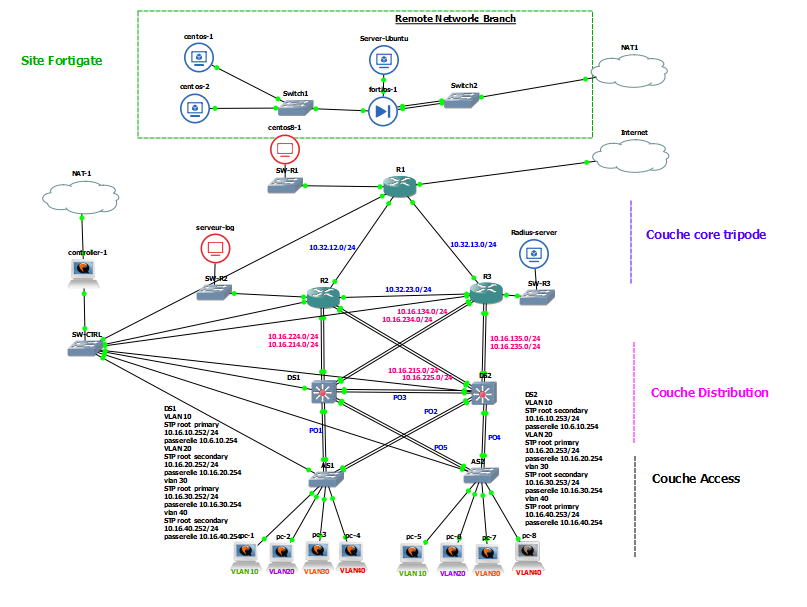

# Documentation générale du projet 4

Ce document présente globalement ce que nous avons mis en place grace au logiciel open source *GNS3*. Nous y décrirons les périphériques employés ainsi que les protocoles utilisés.

## 1 Topologie

## 2 Plan d'adressage
Le plan d'adressage de notre topologie est accessible ici *https://github.com/reseau-2020/projet-four/blob/master/topo/plan_adressage.md*.

### IPv4
En IPv4, nous avons utilisé des adresses en `10.32.X.X` pour les liaisons interne à la couche *CORE* et en `10.16.X.X` pour les liaisons entre les liaisons impliquant les couches *DISTRIBUTION* et *ACCESS*. Chaque sous-réseau possède un masque égal à 255.255.255.0. Le troisième octet des adresses renseigne sur la liaison entre les périphériques concernés. Par exemple, les routeurs *R1* et *R2* sont reliés en `10.32.12.1` (sur R1) et `10.32.12.2` (sur R2). On assigne 4 à *DS1* et 5 à *DS2*, ainsi *R3* et *DS2* sont reliés par `10.16.135.1` et `10.16.235.2` (sur *R3*), `10.16.135.2` et `10.16.235.1` (sur *DS2*).
Les *VLANs 10, 20, 30 et 40* prennent les adresses `10.32.10.X`, `10.32.20.X`, `10.32.30.X` et `10.32.40.X`.
Pour le site distant nous avons utilisé des adresses privées en `192.168.150.X`.

### Ipv6
L'adressage IPv6

## 3 VLAN
## 4 Spanning-tree
Le protocol *Spanning-tree* est implémenté sur les 4 périphériques de couche 2 : *AS1*, *AS2*, *DS1* & *DS2*. *DS1* est `root primary` pour les vlans 10, 30 et 99 (natif) et `secondary` pour les vlans 20 et 40. Respectivement, *DS2* est `root primary` pour les vlans 20 et 40 et `secondary` pour les vlans 10, 30 et 99.

## 5 Etherchannel
Nous avons monté 5 ports Etherchannel :

Ports channel | Ports physique | Commutateurs
|-------------|----------------|-------------
po1  | g0/0, g1/0 | AS1-DS1
po2  | g0/1, g1/1 | AS1-DS2
po3  | g0/2, g1/2 | DS1-DS2
po4  | g0/0, g1/0 | AS2-DS2
po5  | g0/1, g1/1 | AS2-DS1

## 6 HSRP
## 7 DHCP & DNS
Les services *DHCP* et *DNS* sont déployés sur *DS1* et *DS2*, en IPv4 et IPv6.

## 8 EIGRP
Le protocol de routage implémenté sur les périphérques de couche 3 : *R1*, *R2*, *R3*, *DS1* & *DS2* est *EIGRP*, son id est 1. Le protocol est déployé en IPv4 et Ipv6.
## 9 NAT
## 10 IPv6
## 11 Pare-feux & VPN IPsec
### Pare-feux
Nous avons mis en place deux pare-feux : un ZBF de Cisco sur *R1* dans le site principal et un pare-feu fortigate dans le site distant.
Sur le Cisco nous avons créé trois zone :
- Internet : `zone security lan`
- Lan : `zone security internet`
- DMZ : `zone security dmz`

Succinctement, les protocoles autorisés entre zones sont : 
- lan -> internet :  http, https, dns, icmp, ssh
- lan -> dmz : http, https, ssh, icmp
- internet -> dmz : http, https
- dmz -> internet :  http, https, dns, icmp, ssh

Nouss n'avons pas créé de zones dmz sur le site distant, ce dernier nous étant utile seulement pour construire un tunnel VPN.
 
### VPN
Nous avons monté un tunnel entre les deux sites via une authentification `esp-des` et un encryptage `esp-md5-hmac`. La différence des pare-feux de chaque côtés ainsi que les versions limitées offertes par *GNS3* ne nous ont pas permis d'avoir un tunnel 100% efficace. Il se monte bien dans le sens **Site Principal** => **Site Distant**, mais pas inversement.

## 12 SNMP
## 13 SYSLOG
## 14 NTP
## 15 Radius
## 16 Sécurité
## 17 Fiabilité

