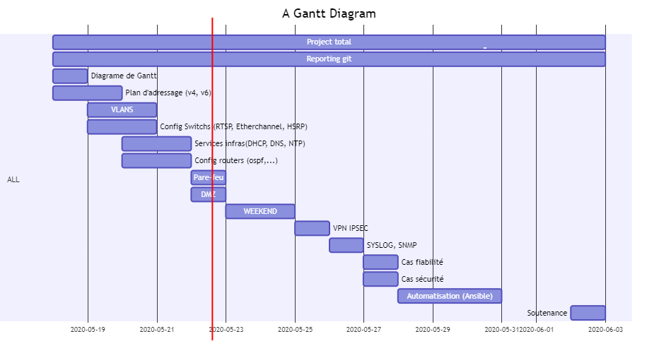

Tâches réalisées aujourd’hui 22/05/2020

-	Finir la configuration de trois routeurs,
-	Implémenter le Nat sur R1
-	Tester la connectivité
-	Mise en œuvre d’un pare-feu Cisco sur R1
-	Mise en œuvre d’une zone DMZ 
-	Mise en place d’un site distant connecté en VPN IPSEC

Tâches à réaliser pour 25/05/2020

-	Implémenter NTP, le syslog et SNMP
-	Elaborer un cas qui éprouve la fiabilité de la solution et un autre qui éprouve la sécurité de la solution
-	Partir sur ansible

*
