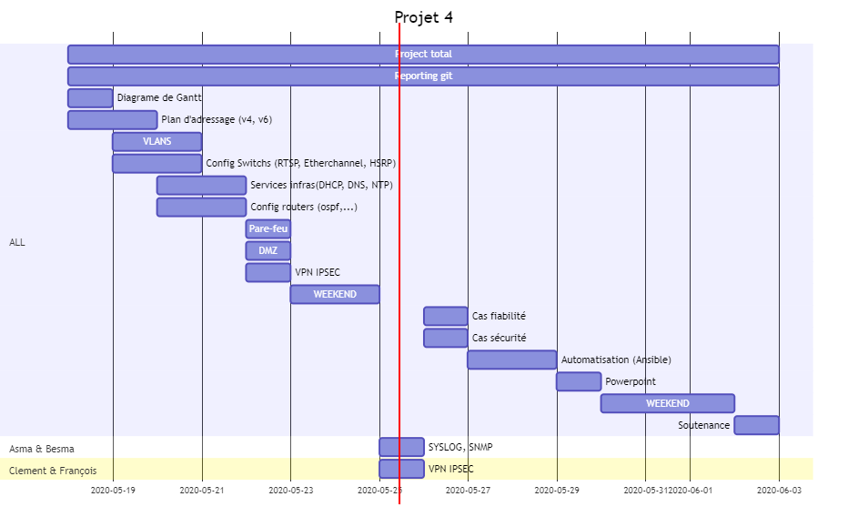

# Jour 5 : 25/05/2020

Tâches réalisées aujourd’hui

- Asma et Besma ont configuré SYSLOG, SNMP et NTP sur les périphériques (routeurs et switchs)
- Clément et François ont finalisé le tunnel VPN entre le site distant (pare-feu fortinet) et le site central (pare-feu Cisco). Connexion en ssh réusssie

Tâches à réaliser pour 26/05/2020

- Tester la topologie avec un cas fiablité et un cas sécurité
- Ajuster les configs si nécessaire
- Partir éventuellement sur Ansible 

