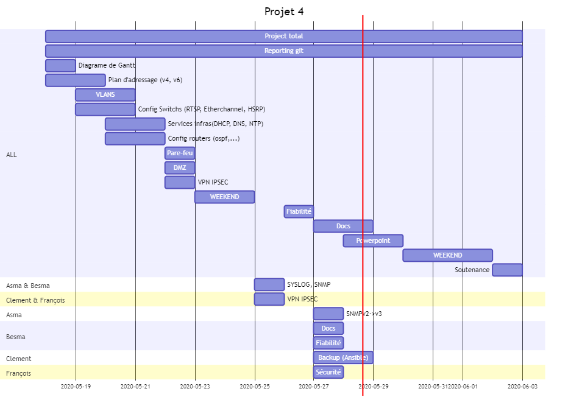

# Jour 8 : 28/05/2020

Tâches réalisées aujourd’hui

- backup des configs avec Ansible
- Alimenter la documentation
- Réfléchir à propos la présentation

Tâches à réaliser pour 29/05/2020

- Préparer la présentation

